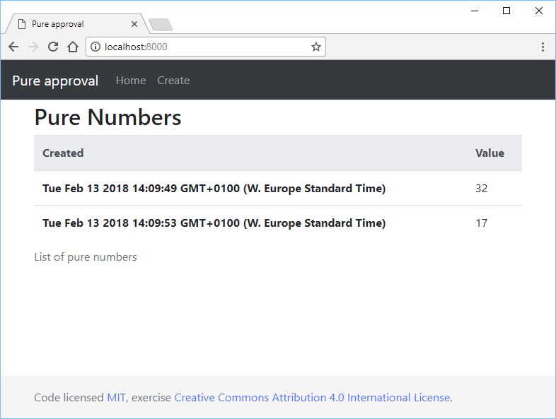

# Pure approval

In this exercise, you should write a web application with [Express](http://expressjs.com/) and persistent data stored by MongoDB through [Mongoose](http://mongoosejs.com/). This exercise is also about how to validate user input through Mongoose schema and presenting information to the user through "flash messages".

The application is a simple type where the user can write a number between 1 and 42 to be stored persistently.

The application's start page should have a navigation bar with a home- and a create link. On this page, all the objects in the database (numbers with creation timestamp) should be shown.

## Create

When clicking on the create-link the user should see a form that is used for entering a number.

### Success

If the number is between 1 and 42 the number should be saved in the database (with a timestamp of the creation) and the user should see a green message that the number is saved when he/she is redirected to a page where all the number created in the database is presented along with the creation data.

### Error

If the user gives a number that is not between 1 and 42 the application should respond with an error message; the same goes for any other type of error.

## Custom handling of 404 and 500

Of course, there should be a custom handling of the 404 and 500 error in your application to.

## Hints

For handling the errors you should look up how to handle "flash messages", schema validation in mongoose and the understanding of middleware in Express.

## Solution

- <https://github.com/1dv023/exercise-pure-approval-SOLUTION>
